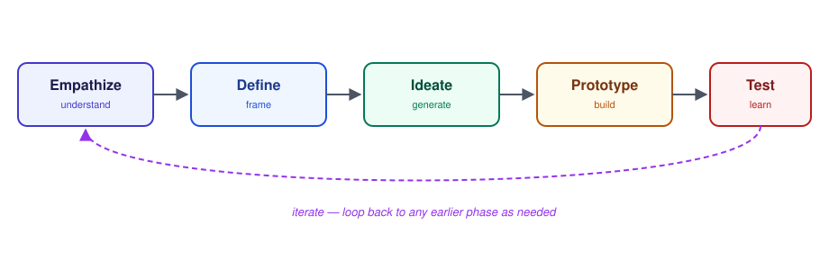

# Design Thinking — What is Design Thinking (5 Phases)

_Last updated: 2026-08-25_

## Overview

Design Thinking is a human-centered problem-solving methodology built around five phases — Empathize, Define, Ideate, Prototype, Test. It's less about the five labeled steps and more about a discipline: staying in the problem space longer than feels comfortable before committing to a solution.

## The big picture

The phases are drawn as a line, but the process is **not linear in practice** — teams loop backward constantly. Testing often reveals the problem was framed wrong, sending the team back to Define or even Empathize. That looping is a feature, not a failure.

## 1. Empathize — understand the human

Set aside your own assumptions and learn how real people actually experience the problem.

- Methods: interviews, observation (watching someone use something in their real context), immersion (experiencing the situation yourself).
- Goal: understand **needs, motivations, and pain points** — often ones the person can't articulate directly themselves.
- Classic example: early users didn't ask for a "faster horse," they needed faster *travel*.

## 2. Define — frame the right problem

Synthesize everything from Empathize into a clear, actionable problem statement — a **Point of View (POV)**:

> [User] needs a way to [need] because [insight].

This is the phase most often skipped, and the most consequential one to skip — frame the problem wrong and every downstream phase optimizes for the wrong target, even if Ideate and Prototype are executed brilliantly.

A common tool: reframe the POV into a **"How Might We" (HMW)** question, turning a problem statement into an open invitation for ideas.

- POV: "New employees need a way to feel confident asking questions because they fear looking incompetent."
- HMW: "How might we make asking questions feel safe for new employees?"

## 3. Ideate — generate options, don't filter yet

Divergent thinking: generate a *wide* volume of ideas before converging on one.

- The discipline is deferring judgment — critiquing too early anchors the team on the first plausible idea instead of finding a better one.
- Techniques: brainstorming, "Crazy 8s" (8 ideas in 8 minutes), worst-possible-idea (to break fixation).

## 4. Prototype — make it tangible, cheaply

Build just enough to test an idea — sketches, paper mockups, clickable wireframes, role-play.

- Rule of thumb: use the **lowest fidelity that still answers your question**.
- A paper sketch can validate a flow; working code isn't needed to learn whether people understand a concept.

## 5. Test — put it in front of real users

Show the prototype to actual users (ideally the same people from Empathize) and observe, don't just ask "do you like it?" — watch what they *do*, listen to what confuses them.

- Test results almost always send the process back a step — sometimes just to refine the prototype, sometimes all the way back to reframing the problem.

## Key Takeaways

- Design Thinking = a discipline of staying in the problem space before committing to a solution, treating early solutions as questions to test, not answers to defend.
- The 5 phases (Empathize → Define → Ideate → Prototype → Test) are iterative, not a strict sequence — looping backward is expected.
- Skipping or rushing Define is the most common and most costly mistake — it misdirects every phase after it.
- Prototype fidelity should match the question being asked, not the polish of the final product.
