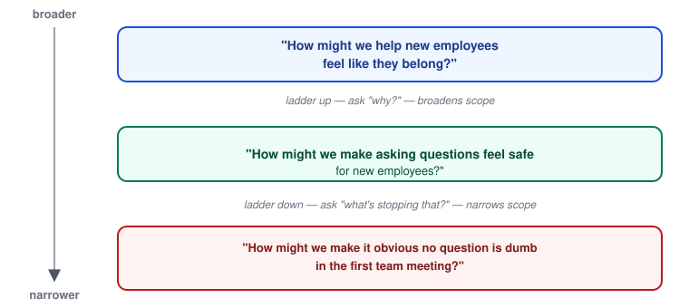

# Design Thinking — How Might We & Problem Framing

_Last updated: 2026-08-25_

## Overview

This picks up where Define leaves off: turning empathy research into a sharp, actionable problem statement. Covers the Point of View (POV) statement, converting a POV into a "How Might We" (HMW) question, and tuning an HMW's scope with laddering.

## Why framing matters more than it seems

A vague problem produces vague solutions. "Improve onboarding" gives a team nothing to design against — everyone imagines a different fix. Framing narrows a messy pile of research into a statement specific enough to generate ideas *against*, but not so narrow it presupposes the solution.

There's a tension to manage:

- **Too broad** ("Make the app better") → no direction, ideation stalls or wanders.
- **Too narrow** ("Add a tooltip to the settings icon") → a solution has been smuggled into the problem statement, foreclosing better ideas before Ideate even starts.

Good framing sits in between: constrained enough to focus effort, open enough to allow multiple solutions.

## From research to POV statement

The **Point of View (POV)** statement is the bridge between Empathize and Ideate:

> **[User]** needs a way to **[need]** because **[insight]**.

Each piece does a specific job:

- **User** — a specific person or role, not "users" in the abstract. Specificity keeps the team designing for someone real instead of an average of everyone.
- **Need** — a verb-based need, not a feature. "Needs a way to feel confident," not "needs a tooltip." The need should be solution-agnostic — if the UI can already be pictured from the statement, it's too narrow.
- **Insight** — the *why*, usually the most valuable part, straight from Empathize. It's often surprising — the insight is what reframes the problem from what people say they want to what's actually driving their behavior.

## Turning a POV into a "How Might We"

The POV is a statement; HMW turns it into a question the team can ideate against. Mechanically: drop in "How might we," and rephrase the need as an open invitation.

> POV: "New employees need a way to feel confident asking questions because they fear looking incompetent."
> HMW: "How might we make asking questions feel safe for new employees?"

### Calibrating scope — laddering

If an HMW produces ideas that are too narrow or too broad, scope can be adjusted by laddering up or down:

- **Ladder up** (ask "why?") → broadens scope. "How might we make asking questions feel safe?" → "How might we help new employees feel like they belong?"
- **Ladder down** (ask "what's stopping that?") → narrows scope. → "How might we make it obvious that no question is a dumb question in the first team meeting?"

Teams often generate a few HMWs at different ladder heights and pick the one that best matches how much creative range they want in Ideate.

### Common failure modes

- **Solution-in-disguise HMW**: "How might we add a chatbot to answer new-employee questions?" — this isn't a problem frame anymore, it's a solution wearing a question mark. Ideation against it just refines the chatbot instead of exploring the space.
- **HMW with no insight behind it**: skipping straight from a vague observation to an HMW without a real POV first — produces generic ideas because there's no specific *why* constraining what "good" looks like.

## Key Takeaways

- Framing sits between too-broad (no direction) and too-narrow (solution already baked in) — that's the target zone.
- POV statement = User + Need (verb-based, solution-agnostic) + Insight (the *why*, usually the most valuable/surprising part).
- HMW turns a POV into an actionable question for Ideate — it should invite many solutions, not describe one.
- Laddering (asking "why?" to broaden, "what's stopping that?" to narrow) lets an HMW's scope be tuned up or down.
- A red flag for a bad HMW: if the single feature it's pointing at can already be pictured, it's too narrow — it's a solution, not a frame.
