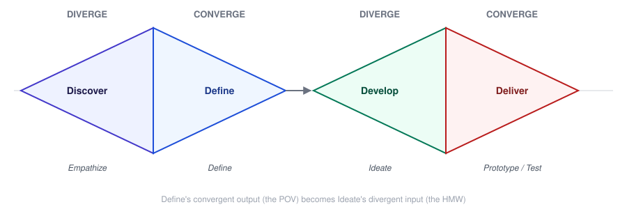

# Design Thinking — Divergent vs. Convergent Thinking

_Last updated: 2026-08-25_

## Overview

The diverge/converge rhythm is the mental gear-shift underneath every phase of Design Thinking — less a single "step" and more a mode consciously turned on and off throughout the process. Covers what each mode is for, how it maps onto the double diamond, why mixing the two breaks things, and techniques for running each well.

## The two modes

- **Divergent thinking** — expanding the possibility space. Generate many options, defer judgment, tolerate (even seek out) weird or "wrong" ideas. Optimizes for *quantity and variety*.
- **Convergent thinking** — narrowing the possibility space. Evaluate, compare, select. Optimizes for *decisiveness* — landing on the best option(s) to move forward with.

Neither is "better" — they're sequential tools for different jobs. The failure mode is doing them at the same time.

## The double diamond

This diverge/converge rhythm repeats across the whole process, not just in Ideate:

- **First diamond**: diverge in Empathize (gather many observations, talk to many people, resist forming an opinion yet) → converge in Define (narrow all that down to one POV statement).
- **Second diamond**: diverge in Ideate (generate many possible solutions to the HMW) → converge in Prototype/Test (narrow down to the idea(s) worth building and validating).

Each diamond's convergent half also feeds directly into the next diamond's divergent half — the POV converged on in Define is exactly what gets diverged *against* in Ideate.

## Why mixing them breaks things

If judgment creeps into a divergent session — "that idea's silly, let's not write it down" — the group anchors on whatever's already been said and quietly stops generating new options. That loses exactly the wide net divergent thinking exists to cast.

If a convergent session doesn't actually happen — nobody ever picks — the result is analysis paralysis: a long list of ideas and no decision, so nothing moves to Prototype.

The practical fix is **separating the two in time**, not just in theory: run a divergent session with an explicit "no judgment" rule, end it, *then* switch modes and run a separate convergent session on the resulting list.

## Techniques for each mode

**Divergent** (deferring judgment, maximizing quantity):
- "Yes, and" — build on ideas instead of shutting them down.
- Quantity targets (e.g. Crazy 8s: 8 ideas in 8 minutes) — forces past the first few obvious ideas into more original territory.
- Silent brainstorming (write ideas individually before sharing) — prevents the loudest voice from anchoring the group early.

**Convergent** (evaluating, selecting):
- Dot voting — each person gets a fixed number of votes to distribute across the generated ideas; fast, visible, low-ego.
- Affinity mapping — cluster similar ideas together first, so the choice is between clusters/themes rather than an overwhelming raw idea count.
- Criteria-based scoring — score each idea against a few shared criteria (e.g. feasibility, impact, novelty) instead of gut-feel picking.

## Key Takeaways

- Divergent thinking expands the option space (quantity, deferred judgment); convergent thinking narrows it (evaluation, decision).
- The double diamond is this same diverge/converge move applied twice: once to the problem (Discover → Define) and once to the solution (Develop → Deliver).
- Mixing the two modes in one session is the main failure: judgment during divergence kills idea generation; skipping convergence causes analysis paralysis.
- Keep the modes separated in time — a divergent session with a no-judgment rule, followed by a distinct convergent session on the results.
