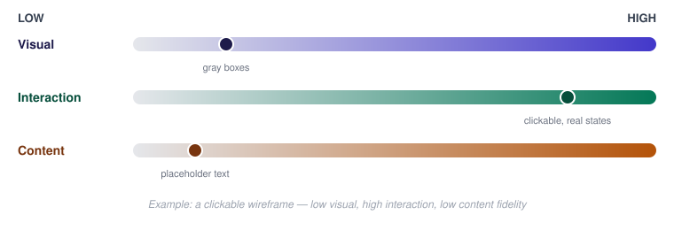

# Design Thinking — Prototyping Fidelity (Low-Fi vs. Hi-Fi)

_Last updated: 2026-08-25_

## Overview

Fidelity is really at least three independent dimensions — visual, interaction, and content — not a single low-to-high dial. Covers what each dimension means, when low-fi vs. hi-fi pays off, Wizard of Oz prototyping, and a practical pitfall around mismatched expectations.

## Fidelity isn't one axis

A prototype can be high on one dimension and low on another at the same time:

- **Visual fidelity** — how close it looks to the finished UI (grayscale boxes vs. pixel-perfect design).
- **Interaction fidelity** — how much it actually behaves like the real thing (static image vs. clickable, with real transitions/states).
- **Content fidelity** — how real the data/copy is (lorem ipsum and placeholder names vs. real content).

A **clickable wireframe** — the classic "low-fi" prototype — is actually low visual fidelity but *high* interaction fidelity. Naming the three dimensions separately makes it possible to deliberately choose which one to invest in for a given question, instead of treating "fidelity" as a single dial.

## Low-fidelity: paper sketches, wireframes

Fast, cheap, disposable — throwing one away costs nothing, so nobody's precious about it.

- Signals "this isn't finished" — which paradoxically produces more honest feedback. People critique the underlying idea and flow rather than the color choices, because the visual roughness makes it clear those choices haven't been made yet.
- Best for validating: overall flow, information architecture, whether the concept solves the right problem at all.

## High-fidelity: polished mockups, interactive prototypes

Looks and often behaves like the real product — pixel-accurate visuals, real transitions, sometimes real or realistic data.

- Best for validating: detailed usability issues, visual hierarchy, micro-interactions, stakeholder/investor buy-in — questions that only show up once the surface is close to final.
- The risk of reaching for hi-fi too early is **premature convergence**: polish makes people react to the pixels instead of the structure, feedback shifts from "does this flow make sense" to "I don't like that shade of blue," and — because it took real effort to build — there's now sunk-cost pressure not to throw it away even when the underlying concept is wrong.

## The rule of thumb

Use the lowest fidelity that still answers the question in front of you. If the question is "does this flow make sense," a sketch answers it. Building a polished interactive mockup to answer a flow question is over-investing before the flow itself is validated — expensive rework later if it turns out to be wrong.

Mapped onto the double diamond: while still diverging or just converging on a direction (Discover/Define, early Develop), low-fi is usually enough. Once a direction is locked and the questions are about detailed interaction or visual polish (late Develop, Deliver), fidelity investment pays off.

## Wizard of Oz prototyping

A technique for testing something that would be expensive to actually build: the "system" is real to the user, but a human is secretly operating it behind the scenes (e.g. manually typing responses that appear to come from an automated feature).

- Deliberately mismatched fidelity on purpose — can be high visual/interaction fidelity (looks and feels real) while being effectively zero engineering-functional fidelity underneath.
- Especially useful for testing AI or automation-dependent features, where building the real backend is the expensive part and what's actually being validated is whether people want/trust the *behavior*, not whether the model works yet.

## A practical pitfall: mismatched expectations

Building a visually hi-fi prototype that isn't actually clickable (a static image made to look real) risks testers assuming broken interactions are bugs rather than a deliberate limitation of the prototype. Fidelity mismatches like this need to be set explicitly before testing — tell the tester what is and isn't real — or the test session gets derailed on confusion about the tool instead of the design.

## Key Takeaways

- Fidelity has (at least) three independent dimensions: visual, interaction, content — a prototype can be high on one and low on another.
- Low-fi produces more honest structural feedback because its roughness signals "unfinished"; hi-fi risks premature convergence onto surface details.
- Rule of thumb: use the lowest fidelity that still answers the question being tested.
- Wizard of Oz prototyping deliberately fakes functional fidelity behind a real-looking interface — useful for AI/automation features where the backend is the expensive part.
- Mismatched fidelity (looks real but isn't clickable) needs to be flagged to testers up front, or confusion about the prototype derails the test.
