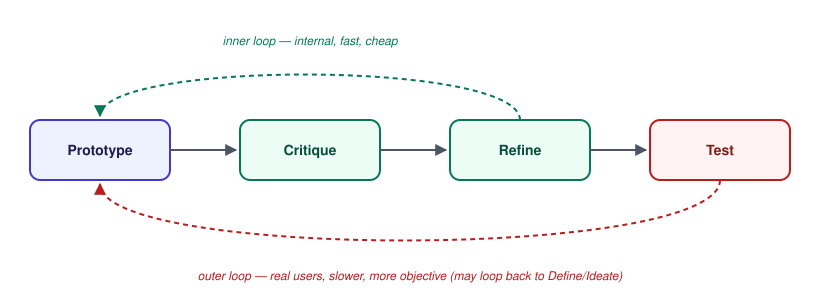

# Design Thinking — Design Critique & Iteration Loops

_Last updated: 2026-08-25_

## Overview

This is what actually closes the iteration loops referenced throughout the earlier docs — the "loop back" arrow in the 5 phases, and Test feeding back into earlier diamonds in the double diamond. Covers what makes critique different from casual feedback, a lightweight critique structure, how to run the session, where critique sits relative to user testing, and when to stop iterating.

## Critique ≠ casual feedback

A design critique is a **structured** feedback session, distinct from someone glancing at a screen and saying "I like it" or "something feels off." The distinction matters because unstructured feedback is usually vague, personal, and hard to act on — "I don't love it" gives the designer nothing to actually change.

Good critique is anchored to a goal, not to taste:

- Bad: "I don't really like the layout."
- Good: "The POV said new employees need to feel safe asking questions — this screen buries the help option three taps deep, which works against that."

The second version ties feedback directly back to the POV/HMW from Define — the same problem frame the prototype is supposed to be solving. Critique that isn't anchored to the goal degrades into a taste contest.

## A simple structure: "I like, I wish, What if"

A common lightweight framing for critique comments, useful because it separates *reinforcement* from *concern* from *suggestion* instead of blending them into one vague reaction:

- **I like** — what's working and should be kept (reinforces good decisions so they don't get accidentally undone in the next iteration).
- **I wish** — a specific concern or gap, phrased without prescribing the fix.
- **What if** — an optional idea, explicitly framed as a possibility, not a demand.

Keeping "I wish" (the problem) separate from "what if" (a possible solution) matters because jumping straight to fixing in the room — "solutioning" — tends to shut down better solutions the designer might land on with more thought. Naming the problem is the critique's job; solving it belongs back in Ideate/Prototype.

## Structuring the session, not just the comment

- **Presenter frames first**: before anyone reacts, the presenter states the goal (POV/HMW) and any specific open questions they want feedback on. This keeps the room's attention on the intended problem instead of drifting into unrelated tangents.
- **Round-robin, not loudest-voice-first**: everyone gives feedback in turn, rather than the most senior or most vocal person setting the tone and everyone else anchoring to it — the same groupthink risk covered in the ideation techniques doc.
- **Diagnose, don't solve, in the room**: critique surfaces problems; fixing them happens afterward, back in the design work itself.

## Where critique sits in the iteration loop

Critique is a **tighter, faster loop** than user testing — internal, cheap, frequent — sitting inside the larger Prototype → Test loop from the double diamond:

The inner loop (critique) catches structural and usability problems before they ever reach a real user — cheaper to catch here than after a full test session. The outer loop (Test) is still necessary because critique from people close to the project can miss things only a fresh, uninvested user would notice.

## Knowing when to stop iterating

Iteration isn't infinite by default — it needs an exit condition, or a team can loop forever without shipping. The practical criteria:

- Does the prototype satisfy the POV/HMW it was built against?
- Does user testing show the actual pain point identified in Empathize is resolved?

Once both are true, iteration on *that* problem is done — even if the design could theoretically still be polished further. Further polish past that point is a different kind of work (refinement) than iteration (fixing something that doesn't yet work).

## Key Takeaways

- Critique differs from casual feedback by being anchored to the POV/HMW goal, not personal taste.
- "I like, I wish, What if" separates reinforcement, concern, and suggestion — and keeps the room from "solutioning" a problem before it's fully named.
- Structure the session itself: presenter frames the goal first, feedback goes round-robin (not loudest-voice-first), and the room diagnoses rather than solves live.
- Critique is a fast, cheap, internal loop nested inside the slower, more objective, real-user Test loop — both are the same "converge, maybe loop back" mechanism at different scales.
- Iteration has an exit condition: the prototype satisfies its POV/HMW and testing confirms the original pain point is resolved. Anything past that is refinement, not iteration.
