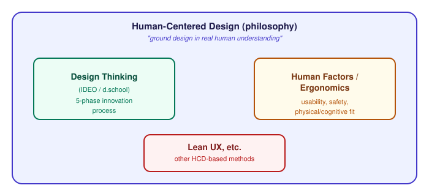

# Human-Centered Design — HCD vs. Design Thinking

_Last updated: 2026-08-25_

## Overview

Human-Centered Design (HCD) is a design philosophy; Design Thinking is one specific, packaged methodology for practicing it. The two get used interchangeably in casual conversation, but they're not the same kind of thing — one is a principle, the other is a named process built on top of it.

## What HCD actually is

Human-Centered Design is a design *philosophy* (formalized as ISO 9241-210, the international standard for it): design should be grounded in a deep understanding of the humans who'll use it — their needs, capabilities, limitations, and context — arrived at through iterative cycles of design and evaluation.

It's older and broader than Design Thinking, with roots in human factors engineering and ergonomics (originally: does this cockpit fit a human body and cognition, safely?), later expanded by people like Don Norman into "user-centered design" for software and products generally.

The ISO standard defines required *activities*, not a fixed sequence of named steps:

1. Understand and specify the context of use
2. Specify the user requirements
3. Produce design solutions
4. Evaluate the design against requirements
5. Iterate

This is a set of activities to satisfy, not a branded 5-phase process — any methodology that does these things, in whatever order or format, counts as "human-centered."

## What Design Thinking actually is

Design Thinking (the 5 phases: Empathize, Define, Ideate, Prototype, Test) is **one specific, packaged implementation** of HCD principles — popularized by IDEO and Stanford's d.school as a repeatable process teams (including non-designers) could follow for creative problem-solving and innovation.

It's not the only methodology built on HCD principles — Lean UX, participatory design, and classic human factors/ergonomics practice all also satisfy the HCD philosophy, just with different processes and different emphases.

## How they fit together

Design Thinking sits *inside* HCD as one named methodology among several — not a synonym for it.

## Where the emphasis actually differs

- **Scope**: HCD applies to any design process — industrial design, physical ergonomics, software — with no fixed framework attached. Design Thinking is a specific packaged process, most associated with early-stage innovation and problem framing.
- **What "human" means**: classic human factors/HCD work is often about *users of a system* in a fairly direct usability sense (does this control panel work for a human operator?). Design Thinking is frequently used upstream of any system at all — redesigning a hospital intake process, a school experience — where "the human" isn't yet a "user" of anything specific.
- **Formality**: HCD has an actual ISO standard defining required activities. Design Thinking has no such standard — IDEO's version, the Stanford d.school's version, and IBM's version of it all differ somewhat in phase names and emphasis.
- **Business framing**: Design Thinking explicitly folds in a third lens beyond just the human — IDEO frames it as balancing **desirability** (does a human want this), **feasibility** (can it be built), and **viability** (does it make business sense). HCD's ISO definition doesn't build business viability into the definition itself — that's Design Thinking's specific packaging for innovation/business contexts.

## Key Takeaways

- HCD is a design philosophy (formalized in ISO 9241-210); Design Thinking is one specific packaged methodology that implements it.
- Every Design Thinking process is human-centered; not every human-centered process is Design Thinking — Lean UX and classic human factors/ergonomics also satisfy HCD principles differently.
- HCD's required activities (understand context, specify requirements, design, evaluate, iterate) are activity-based, not a fixed named sequence like Design Thinking's 5 phases.
- Design Thinking adds a business framing HCD doesn't inherently require: balancing desirability, feasibility, and viability.
