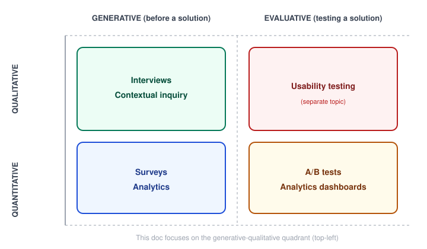

# Human-Centered Design — User Research Methods

_Last updated: 2026-08-25_

## Overview

The toolkit for HCD's first required activity — "understand and specify the context of use" — and Design Thinking's Empathize phase. Covers the two axes that organize the research-methods landscape (qualitative/quantitative, generative/evaluative), then focuses on interviews, contextual inquiry, and surveys, plus the pitfalls that undermine all of them.

## Two axes that organize the whole landscape

Most research methods sit somewhere on two independent axes:

- **Qualitative vs. quantitative** — depth vs. breadth. Qualitative answers *why*, from a small number of people, in rich detail. Quantitative answers *how many/how often*, from a large sample, with much less depth per person.
- **Generative vs. evaluative** — discovery vs. validation. Generative research happens *before* a solution exists, uncovering problems and opportunities. Evaluative research happens *after* a solution exists, testing whether it works (usability testing lives here).

This doc focuses on the generative-qualitative quadrant — interviews and contextual inquiry — plus where surveys fit in as the generative-quantitative counterpart.

## Interviews

Semi-structured, open-ended conversations — a loose guide of topics, not a rigid script, so the conversation can follow what turns out to be interesting.

The most important discipline: **ask about specific past behavior, not hypothetical future behavior.**

- Weak: "Would you use a feature that reminds you to do X?"
- Strong: "Tell me about the last time you needed to do X — walk me through what actually happened."

People are unreliable predictors of their own future behavior — they answer hypotheticals with what they *think* sounds reasonable, not what they'd actually do. Asking about a specific real past instance grounds the answer in something that actually happened, which is far more reliable data.

**Avoid leading questions** — a question that suggests the "correct" answer biases the response before the person even starts thinking:

- Leading: "Don't you find this confusing?"
- Neutral: "Walk me through what you were thinking here."

## Contextual inquiry

A hybrid of interview and observation, conducted *in the person's actual environment* while they perform the task — "go to where the work happens" rather than bringing them into an unfamiliar room to describe it from memory.

- More expensive and time-consuming than a plain interview, but often the highest-fidelity method available, because it surfaces the gap between what people *say* they do and what they *actually* do — workarounds, environmental constraints, and habits people don't think to mention because they're invisible to them.
- Example: someone might describe their process cleanly in an interview, but watching them actually do it reveals they keep a personal spreadsheet on the side because the "official" tool doesn't do something they need — an insight that never would have surfaced from the interview alone.

## Surveys

The generative-quantitative counterpart: good for quantifying or validating something already discovered qualitatively, or for reaching a much larger sample than interviews allow.

- Weak for *discovering* unknown problems — a survey can only ask about what the researcher already thought to ask, so it's a poor tool for finding out what you don't know you don't know.
- Strong for confirming how widespread a pattern is once interviews have already surfaced it: "we heard this pain point from 5 interviewees — does it show up broadly, or was that a coincidence of who we talked to?"

## Common pitfalls across all of them

- **Leading questions** — biasing the answer by suggesting what the "right" response is.
- **Hypothetical-future bias** — asking people to predict their own future behavior instead of recounting actual past behavior.
- **Confirmation bias** — unconsciously steering questions (or interpreting ambiguous answers) toward the answer already expected, instead of genuinely testing that assumption.

## Key Takeaways

- Research methods sit on two independent axes: qualitative vs. quantitative (depth vs. breadth) and generative vs. evaluative (discovery vs. validation).
- Interviews and contextual inquiry are generative-qualitative — for discovering what's going on and why, before a solution exists.
- Surveys are generative-quantitative — for measuring how widespread an already-discovered pattern is, not for discovering unknown problems.
- The single most important interview discipline: ask about specific past behavior, not hypothetical future behavior — people are unreliable predictors of their own future actions.
- Contextual inquiry is expensive but often highest-fidelity, because it surfaces the gap between what people say they do and what they actually do.
