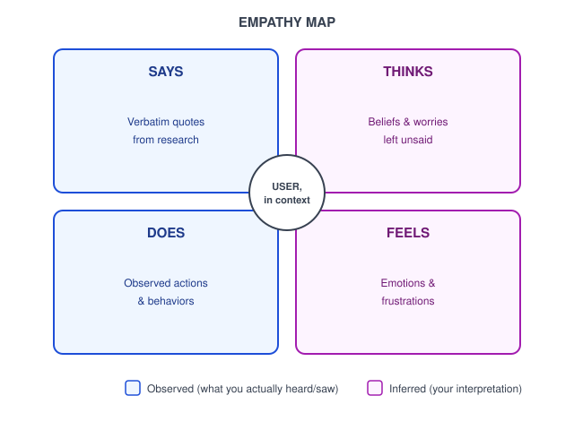
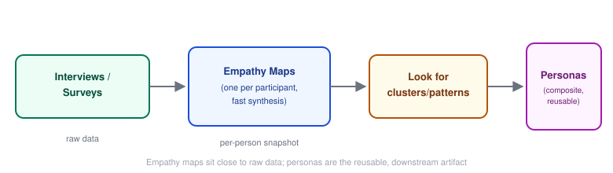

# Human-Centered Design — Personas and Empathy Maps

_Last updated: 2026-09-25_

## Overview

Two of the most commonly used — and commonly misused — synthesis tools in HCD. Personas answer *who* you're designing for; empathy maps answer *what it's like* to be that person in a given context. Covers how each is built, the discipline that keeps them research-grounded rather than assumption-based, how they feed into each other, and the failure modes that show up in practice.

## Personas vs. empathy maps

| | Persona | Empathy Map |
|---|---|---|
| Question it answers | **Who** are we designing for? | **What is it like** to be this person, in a given context? |
| Format | A composite character profile | A four-quadrant snapshot |
| Lifespan | Reusable across many projects/features | Often single-use, tied to one research session or scenario |
| Risk if done badly | Becomes a stereotype/marketing persona, not research-backed | Becomes a guessing exercise if not grounded in real data |

## Personas

A persona is a **fictional but research-grounded** archetype representing a cluster of real users who share goals, behaviors, and pain points.

Typical anatomy:

- Name + photo (humanizing, memorable — "Priya" not "User Segment 3")
- Goals & motivations (e.g. "wants to file expenses in under 2 minutes")
- Frustrations/pain points
- Behavioral traits (tech-savviness, context of use — mobile on the go vs. desktop at work)
- A representative quote

**Critical distinction:** a persona should be built by *clustering patterns from actual research data* (interviews, surveys), not invented from stakeholder assumptions. Skipping research and brainstorming "our user is a busy millennial mom" produces a **marketing persona / proto-persona** — useful for early alignment, but a hypothesis, not a research artifact. A real persona gets validated and revised as research accumulates.

Common failure mode: creating 8 personas to be "inclusive," after which nobody can remember any of them. 3–5 well-differentiated personas, each mapped to genuinely distinct needs, is far more usable than a large cast.

## Empathy maps

An empathy map is a lighter-weight, faster synthesis tool — usually a 2×2 grid (sometimes with a center circle for the user/persona). Classic quadrants: **Says**, **Thinks**, **Does**, **Feels**.

The key discipline is the split between observed and inferred:

- **Says / Does** — directly from observation: things actually heard or watched.
- **Thinks / Feels** — inference: what's believed to be going on beneath the surface, based on tone, hesitation, body language, and context.

Being explicit about this split keeps the team honest about what's evidence vs. interpretation. Some versions add outer **Pains** and **Gains** sections.

Empathy maps are often built **collaboratively in a workshop**, right after a research session while it's fresh — sticky notes on a wall (or Miro/FigJam), one map per participant, sometimes later merged into a composite map that feeds a persona.

## How they fit together in the pipeline

Empathy maps are a **synthesis step** close to raw data; personas are a **downstream artifact** meant to be referenced repeatedly during design and ideation (e.g. "would Priya actually use this menu?").

## Common pitfalls

- **Persona theater** — beautifully designed persona posters nobody actually consults during design decisions. A persona is only useful if it's referenced — e.g. printed near desks, cited in design reviews.
- **Demographic padding** — including age/income/hobbies that don't correlate with any actual behavior relevant to the product. Only include attributes that predict something about how the person will use the thing being built.
- **One persona to rule them all** — cramming conflicting user types into a single persona because there's no budget for more research. Fewer, sharper personas beat one mushy composite.
- **Empathy maps without real data** — turns into "what do we assume this person feels," laundering team bias as if it were research.

## Key Takeaways

- Personas answer *who* (reusable archetype); empathy maps answer *what it's like* (per-context snapshot) — they're complementary, not interchangeable.
- A real persona is built by clustering patterns from actual research data, not stakeholder assumptions — otherwise it's a marketing/proto-persona.
- Empathy maps split observed (Says/Does) from inferred (Thinks/Feels) — keeping that split explicit keeps the team honest about evidence vs. interpretation.
- Pipeline: raw research → per-participant empathy maps → look for clusters/patterns → composite, reusable personas.
- 3–5 sharp, well-differentiated personas beat a large cast that nobody remembers or actually uses.
