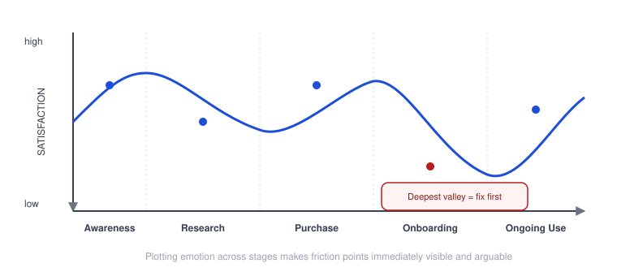
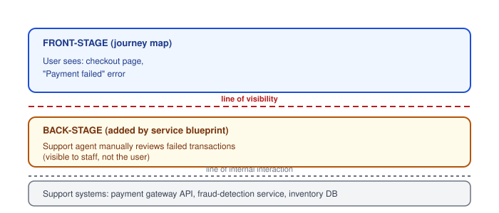

# Human-Centered Design — Journey Mapping and Touchpoints

_Last updated: 2026-09-25_

## Overview

Journey maps add a time axis to the synthesis toolkit: where empathy maps capture a single moment and personas describe a static archetype, a journey map visualizes the full sequence of steps a user takes to accomplish a goal across multiple touchpoints. Covers the map's structure, its signature emotional curve, current-vs-future-state variants, how it relates to (and differs from) a service blueprint, and common pitfalls.

## Core definition

A touchpoint is any point where the user interacts with a product, service, or brand — a screen, an email, a support call, a physical store, a push notification. A journey map lays these out as **stages (columns)** with several **rows of detail** underneath each stage: actions, touchpoints, thoughts, emotions, and pain points/opportunities.

```
STAGE:        Awareness      Research       Purchase       Onboarding      Ongoing Use
ACTIONS       Sees ad on     Reads reviews, Adds to cart,  Sets up         Uses weekly,
              social         compares       checks out     account         hits snag
TOUCHPOINTS   Instagram ad   Review sites   Checkout page  Welcome email   In-app help
THOUGHTS      "Relevant      "Worth the     "Hope this     "More steps     "Why doesn't
              to me?"        price?"        isn't a hassle" than expected"  this work?"
EMOTION       curious        uncertain      relieved       mild frustration frustrated
PAIN POINT/   —              Hard to        Payment form   Too many        No inline
OPPORTUNITY                  compare plans  errors, mobile required fields help at snag
```

## The emotional curve

Most journey maps plot emotion as a literal line graph across the stages — peaks and valleys of satisfaction.



This is the single most useful artifact a journey map produces: it makes the **valleys** — moments of friction or frustration — immediately visible and arguable. Teams naturally gravitate toward fixing the deepest valley first, since that's usually where users drop off or churn.

## Current-state vs. future-state maps

- **Current-state ("as-is")** — documents the experience as it actually is today, warts and all. Used to find pain points.
- **Future-state ("to-be")** — a designed/aspirational version of the journey, used to communicate a redesign vision.

## How it's built

Same discipline as personas and empathy maps: grounded in real research (interviews, contextual inquiry, sometimes analytics for drop-off data), then synthesized across multiple participants into one representative map — not invented from a product team's assumptions about the "ideal" flow.

## Journey map vs. service blueprint

A journey map is deliberately **front-stage only** — it shows what the user sees, does, and feels. It doesn't explain *why* a touchpoint breaks down operationally. A **service blueprint** extends the same structure with what's happening behind the curtain, drawn as a "line of visibility":



So: journey map = what the user experiences. Service blueprint = journey map + what people/systems/processes inside the company make that experience happen (or fail). When a journey map surfaces a pain point but the team can't tell why it's happening operationally, that's the cue to build a service blueprint for that stage.

## Comparison to the other synthesis tools

| | Empathy Map | Persona | Journey Map |
|---|---|---|---|
| Time axis | Single moment/context | N/A (static archetype) | Spans an entire process, stage by stage |
| Question | What's it like right now? | Who is this? | What's the experience like over time, and where does it break down? |
| Best for | Fast synthesis right after a research session | Reusable reference during design decisions | Finding friction points, aligning teams on where to invest |

## Common pitfalls

- **Wrong scope** — mapping "the entire customer relationship" instead of one specific goal/task produces something too vague to act on. Pick a single, concrete journey (e.g. "cancel a subscription," not "be a customer").
- **Documentation without action** — a beautifully designed current-state map that just describes problems without anyone committing to fix the identified valleys is wasted effort.
- **Missing off-screen touchpoints** — mapping only the app/website and skipping phone support, physical locations, or word-of-mouth, even though those are frequently where the real friction lives.
- **One map for all users** — like personas, a single journey map can hide that different user segments take genuinely different paths; sometimes a map per key persona is needed.

## Key Takeaways

- A journey map adds a time axis: stages as columns, with actions/touchpoints/thoughts/emotions/pain-points as rows underneath each.
- The emotional curve — satisfaction plotted across stages — is the map's signature output, making friction points immediately visible and prioritizable.
- Current-state maps find pain points; future-state maps communicate a redesign vision.
- A service blueprint extends a journey map with the "back-stage" systems and processes behind each touchpoint, separated by a line of visibility — use it when a journey map shows a pain point but not why it's happening operationally.
- Scope a journey map to one specific goal, not an entire relationship, and don't forget off-screen touchpoints.
