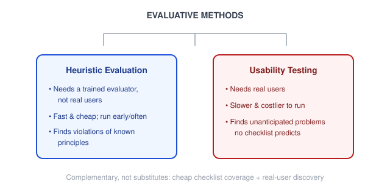
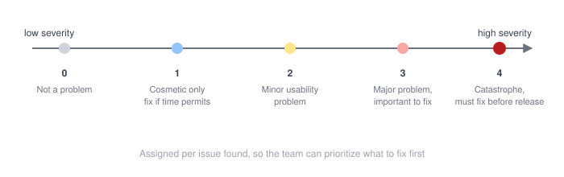

# Human-Centered Design — Usability Heuristics (Nielsen's 10)

_Last updated: 2026-09-25_

## Overview

The most widely cited heuristic evaluation framework — ten broad rules of thumb for critiquing an interface's usability, created by Jakob Nielsen (with Rolf Molich) in 1990 and refined in 1994. Covers where heuristic evaluation sits relative to usability testing, the ten heuristics themselves with examples, how an evaluation actually runs (severity ratings, multiple evaluators), and the pitfalls that undermine the method.

## Where it sits in the toolkit

Heuristic evaluation is **evaluative** (it critiques something that already exists) but, unlike usability testing, it's **expert-based, not user-based** — a trained evaluator walks through the interface and flags where it violates one of the 10 principles, without needing real users in the room.

This makes it fast and cheap to run early and often, but it has a known blind spot: it finds *violations of known principles*, not the surprising things real users actually struggle with. It's typically used as a **complement** to usability testing, not a replacement — catch the obvious stuff cheaply first, then spend the more expensive real-user testing budget on what heuristics can't catch.

## The 10 heuristics

1. **Visibility of system status** — keep users informed about what's going on, via appropriate feedback within reasonable time. *(e.g. a spinner during a slow save, a progress bar during upload.)*
2. **Match between system and the real world** — speak the user's language, not internal jargon; follow real-world conventions. *(e.g. a trash-can icon for delete, not a made-up glyph.)*
3. **User control and freedom** — a clearly marked "emergency exit" for mistakes — undo/redo — without an extended process. *(e.g. "undo send" on email, back button support.)*
4. **Consistency and standards** — users shouldn't wonder whether different words or actions mean the same thing; follow platform conventions. *(e.g. don't use "Submit" in one place and "Send" in another for the same action.)*
5. **Error prevention** — better than a good error message is a design that prevents the problem in the first place. *(e.g. graying out submit until required fields are filled, confirmation dialogs before destructive actions.)*
6. **Recognition rather than recall** — minimize memory load by making objects, actions, and options visible. *(e.g. recently used items instead of requiring retyping.)*
7. **Flexibility and efficiency of use** — accelerators invisible to novices can speed up the interaction for experts. *(e.g. keyboard shortcuts alongside menu items.)*
8. **Aesthetic and minimalist design** — no irrelevant or rarely needed information; every extra unit competes with the relevant units. *(e.g. progressive disclosure — hide advanced settings until asked for.)*
9. **Help users recognize, diagnose, and recover from errors** — plain language (no error codes), precisely indicate the problem, constructively suggest a solution. *(e.g. "This email is already registered — try logging in instead" vs. "Error 402.")*
10. **Help and documentation** — even though it's better if the system needs none, any documentation should be easy to search, focused on the task, and list concrete steps. *(e.g. contextual tooltips over a 200-page manual.)*

## How a heuristic evaluation actually runs

One or more evaluators independently go through the interface (often multiple passes — a first pass for overall flow, a second focused on specific elements), checking it against each of the 10 heuristics. Severity ratings are assigned per issue found, so the team can prioritize:

**Multiple independent evaluators matter a lot** — the single biggest lever on the method's effectiveness. Research behind the method found a single evaluator catches only about 35% of usability problems; Nielsen's own findings suggest **3–5 evaluators** is close to the sweet spot for cost vs. coverage, since each evaluator tends to find a different, only partially overlapping set of problems.

## Common pitfalls

- **Using heuristics as a rigid checklist** rather than a framework for judgment — the value is reasoning about *why* something might confuse a user, not mechanically checking 10 boxes.
- **Single-evaluator evaluations** — treating one person's pass as comprehensive, when research shows individual evaluators miss most problems alone.
- **Evaluator with no UX background** — the method assumes usability expertise; a novice evaluator finds far fewer real problems than a specialist, and "double specialists" (usability + domain expertise) find the most.
- **Treating it as a substitute for usability testing** — it catches known-pattern violations, not what actual users will do when they hit something completely unanticipated. The two methods complement each other; neither replaces the other.

## Key Takeaways

- Heuristic evaluation is expert-based and evaluative — fast/cheap, but limited to catching violations of known principles, not novel user struggles.
- The 10 heuristics span system feedback, real-world matching, user control, consistency, error prevention/recovery, memory load, flexibility, minimalism, and help/documentation.
- Severity ratings (0–4) let a team prioritize which found issues to fix first.
- A single evaluator catches only ~35% of problems alone — 3–5 independent evaluators is the recommended sweet spot.
- Heuristic evaluation and usability testing are complements, not substitutes.
