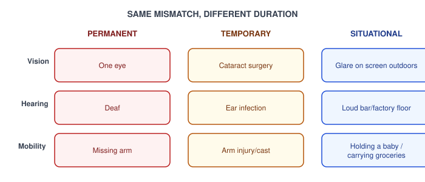
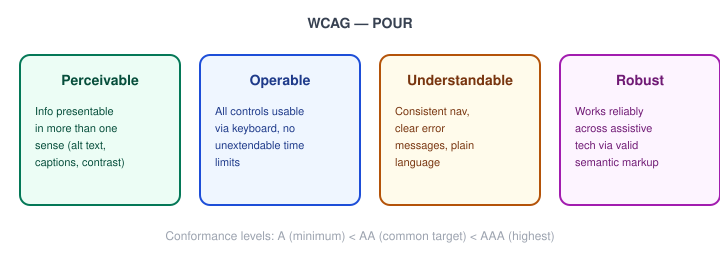

# Human-Centered Design — Accessibility and Inclusive Design Fundamentals

_Last updated: 2026-09-25_

## Overview

Two related but distinct halves: **accessibility** (making things usable by people with disabilities) and **inclusive design** (a broader design philosophy for the full range of human diversity, which produces accessibility as one of its outcomes). Covers the permanent/temporary/situational reframe, the four disability categories, WCAG's POUR principles and conformance levels, concrete techniques, how it's tested, and common pitfalls.

## Inclusive design's core reframe: permanent, temporary, situational

Microsoft's Inclusive Design toolkit argues that "disability" isn't a fixed category of people, but a mismatch between a person and their context — and that mismatch can be **permanent, temporary, or situational**:

The insight: designing a good one-handed/no-hands interaction helps the permanently limited-mobility user, the person with a temporary cast, *and* the person holding a baby or a coffee. Solving for the permanent case tends to solve for the temporary and situational cases too — "designing for accessibility" and "designing for everyone" aren't in tension; the former is a rigorous way to achieve the latter.

## The four disability categories usually discussed

- **Visual** — blindness, low vision, color blindness.
- **Auditory** — deaf or hard of hearing.
- **Motor** — limited fine motor control, tremor, or no use of a mouse/touchscreen at all (keyboard/switch-only navigation).
- **Cognitive** — dyslexia, ADHD, memory or attention differences, non-native language readers.

Most concrete accessibility techniques map to one or more of these categories, which is a useful way to sanity-check coverage of a design.

## WCAG and the POUR principles

The Web Content Accessibility Guidelines (WCAG) are the standard reference, organized around four principles:

- **Perceivable** — information must be presentable in ways users can perceive (not relying on a single sense).
- **Operable** — interface components must be operable by all users.
- **Understandable** — information and UI operation must be understandable (overlaps directly with Nielsen's heuristics 4 and 9 — consistency and clear error messages).
- **Robust** — content must work reliably across a wide variety of user agents, including assistive technologies.

WCAG has three conformance levels — **A** (minimum), **AA** (the level almost everyone actually targets, and what most accessibility laws reference), and **AAA** (highest, often impractical to fully satisfy across an entire site).

## Concrete techniques

- **Semantic HTML and heading structure** — real `<button>`, `<nav>`, `<h1>`–`<h2>` hierarchy, not `
`s styled to look like buttons — this is what lets a screen reader construct a navigable outline of the page.
- **Alt text** for meaningful images; empty `alt=""` for purely decorative ones so a screen reader skips them instead of announcing noise.
- **Color contrast** — WCAG AA requires a 4.5:1 contrast ratio for normal text, 3:1 for large text — and never using color as the only signal (e.g. a red border alone marking a form error is invisible to someone with color blindness; pair it with an icon or text).
- **Keyboard navigability** — every interactive element reachable and operable via Tab/Enter/Space, with a visible focus indicator. A common failure: a custom dropdown or modal a mouse user can operate but a keyboard-only user gets stuck in.
- **ARIA roles/landmarks** — patch semantics HTML can't express on its own (e.g. `aria-live` for a dynamically updating region like a live chat). Rule of thumb: **"no ARIA is better than bad ARIA"** — incorrect ARIA actively misleads assistive tech, so prefer semantic HTML first and only add ARIA where there's a real gap.
- **Captions/transcripts** for audio/video content.
- **Touch target size** — roughly 44×44px minimum, usable by someone with limited fine motor control.
- **Respecting `prefers-reduced-motion`** — some users get genuine physical discomfort (vestibular disorders) from large animations/parallax.

## How it's tested

- **Automated tools** (axe, Lighthouse) — fast, catches roughly 30–40% of issues (missing alt text, contrast failures, malformed markup) but can't judge whether an experience actually makes sense.
- **Manual testing** — navigating with a screen reader (VoiceOver on Mac/iOS, NVDA on Windows) and keyboard-only, no mouse. Most real issues surface here, since automated tools can confirm an ARIA label exists but not that it's the right label or that the flow is logical.
- **Testing with actual disabled users** — the evaluative-with-real-users equivalent of usability testing; the gold standard, same way real user testing complements heuristic evaluation.

## Common pitfalls

- **Bolt-on accessibility** — treating it as a compliance checkbox added at the very end instead of designed in from the start; retrofitting is far more expensive than designing accessibly from the outset.
- **Accessibility overlay widgets** — third-party scripts that claim to "fix" a site's accessibility automatically via a floating widget; widely criticized because they can't fix underlying markup problems and sometimes make things worse for screen reader users.
- **Automated-scan-only compliance** — passing every automated check while still being genuinely unusable with a screen reader, because automated tools can't evaluate logical flow or real semantics.
- **Designing only for the "average" user** — the same trap as personas built from assumptions rather than research: assuming a narrow band of ability represents everyone.

## Key Takeaways

- Inclusive design reframes disability as a permanent/temporary/situational mismatch between a person and their context — designing for the permanent case tends to also solve the temporary and situational cases.
- WCAG's POUR principles (Perceivable, Operable, Understandable, Robust) organize accessibility requirements; AA is the practical/legal target level.
- "No ARIA is better than bad ARIA" — prefer semantic HTML first, and only reach for ARIA to patch a real gap.
- Automated tools catch ~30–40% of issues; manual screen-reader and keyboard-only testing surfaces the rest.
- Accessibility designed in from the start is far cheaper than retrofitting it later, and overlay widgets are not a substitute for fixing underlying markup.
