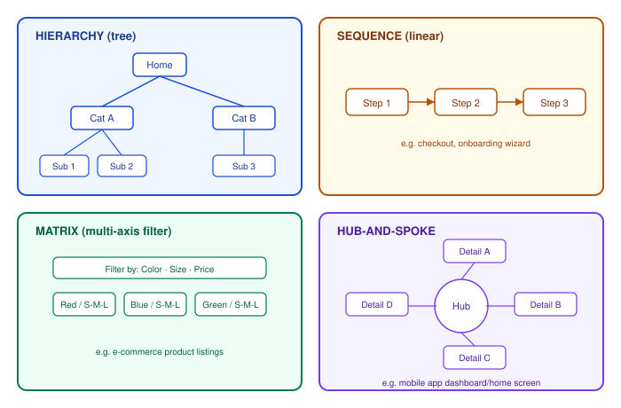

# Human-Centered Design — Information Architecture and Mental Models

_Last updated: 2026-09-25_

## Overview

Information Architecture (IA) is the practice of structuring and organizing content so people can find what they need and understand where they are. This doc covers the base structural patterns IA is built from, the distinction between mental, conceptual, and implementation models, and the methods used to design and validate an IA against how users actually think.

## What IA Is

IA is the "floor plan" of a product — distinct from visual design (how it looks) and interaction design (how it behaves). It answers three questions:

1. **Organization** — how is content grouped and categorized?
2. **Labeling** — what do we call things so people recognize them?
3. **Navigation** — how do people move between areas and find their way back?

A related concept is **findability**: whether a user can locate a piece of content through multiple paths (search, browse, related links) without knowing exactly where it "lives" in the structure.

## Core IA Structures

Most information architectures are combinations of a handful of base patterns:

- **Hierarchy (tree)** — the most common pattern; works when content has clear parent/child relationships (site nav, file systems). Involves a depth vs. breadth tradeoff: too deep and people get lost, too broad and a menu becomes overwhelming.
- **Sequence (linear)** — for linear tasks like checkout flows or onboarding wizards.
- **Matrix (multi-axis)** — for content sliceable by multiple independent attributes, e.g. e-commerce filtering by color/size/price.
- **Hub-and-spoke** — a dashboard or home screen that fans out to independent modules; common in mobile apps.
- **Full mesh / network** — everything links to everything (wikis); powerful but easy to make disorienting without good wayfinding.

Real products blend these — e.g. an e-commerce site is a hierarchy (categories) containing a matrix (filters) leading to a sequence (checkout).

## Mental Model vs. Conceptual Model vs. Implementation Model

This distinction is the crux of why IA and Human-Centered Design are tied together:

| Model | Whose head is it in? | Example |
|---|---|---|
| **Mental model** | The user's — existing beliefs about how something *should* work, formed from prior experience | "Folders contain files, like on my desktop" |
| **Conceptual model** | The designer's — the structure deliberately presented to the user | Google Drive's folder/file metaphor, sharing permissions UI |
| **Implementation model** | The engineer's — how it's actually built under the hood | A flat database of file records with a `parent_id` field and an ACL table |

**Core principle: the smaller the gap between the user's mental model and the designer's conceptual model, the more intuitive the product feels.** Users never see the implementation model directly and shouldn't need to. Confusion arises when:

- The conceptual model **leaks the implementation model** (e.g. exposing a raw database ID in a URL and expecting the user to make sense of it).
- The conceptual model **contradicts an established mental model** (e.g. a "trash" icon that permanently deletes instead of moving to a recoverable bin, violating decades of desktop-metaphor conditioning).

This connects to earlier HCD topics: research methods (interviews, contextual inquiry) are how mental models get *discovered*; personas and journey maps are how findings get *encoded*; usability heuristics like Nielsen's "match between system and the real world" are how the resulting conceptual model gets *evaluated*.

## Designing and Validating an IA

- **Card sorting** — give users content items as cards and have them group them into categories that make sense to them. Open sort: users invent their own categories. Closed sort: categories are given, users just place cards. Reveals the user's natural mental grouping, which may differ from the org chart or database schema.
- **Tree testing** — the reverse of card sorting: give users a bare-bones hierarchy (labels only, no visual design) and a findability task (e.g. "find where you'd renew your passport"). Tests whether a structure supports navigation in isolation from visual polish.
- **Sitemaps / content inventories** — cataloging what content exists before deciding how to structure it.

A common failure mode: designing IA around **internal org structure** ("Marketing's content goes here, Support's goes there") instead of the user's task structure — a mismatch between the company's mental model and the customer's.

## Key Takeaways

- IA = organization + labeling + navigation; distinct from visual and interaction design.
- Base structures — hierarchy, sequence, matrix, hub-and-spoke, full mesh — are usually combined, not used in isolation.
- Mental model (user's head) vs. conceptual model (what's designed) vs. implementation model (how it's built): good IA minimizes the gap between the first two and never leaks the third.
- Card sorting reveals mental models; tree testing validates whether a structure supports findability.
- IA should follow the user's task structure, not the org chart.
