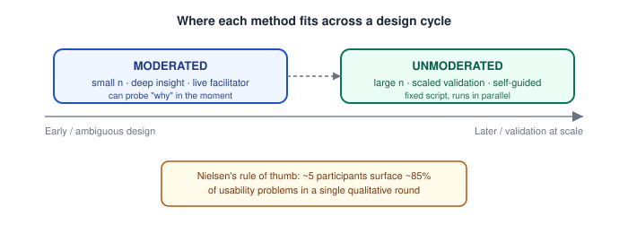

# Human-Centered Design — Usability Testing Basics (Moderated vs. Unmoderated, Think-Aloud Protocol)

_Last updated: 2026-09-25_

## Overview

Usability testing is the user-based, behavioral counterpart to heuristic evaluation covered previously: instead of an expert critiquing an interface against known principles, real users attempt real tasks while researchers observe what they actually do. This doc covers the think-aloud protocol, moderated vs. unmoderated testing, and the practical basics of planning a test.

## What a Usability Test Is

Give a representative user a realistic task ("find a black jacket under $50 and add it to your cart") and observe — without helping — where they succeed, struggle, or fail. The goal isn't opinion ("do you like this button?") but **behavior**: what people actually do when trying to accomplish something, which is often very different from what they'd predict about their own future behavior. Users tend to be unreliable narrators of what they'll do, but fairly reliable narrators of their in-the-moment experience — which is exactly what think-aloud is designed to capture.

## The Think-Aloud Protocol

Ask the participant to **verbalize their thoughts continuously** while working — what they're looking at, what they expect to happen, what confuses them, what they're about to try next.

```
Facilitator: "As you work through this, please say out loud
              whatever you're thinking — what you're looking at,
              what you expect will happen, if something confuses you."

Participant: "Okay, I'm looking for... hm, I'd expect 'Filters'
              to be near the search bar, but I don't see it...
              oh wait, there's a little icon here, I guess
              that's it? Let me click it."
```

Two flavors:

- **Concurrent think-aloud** — narrate *while* doing the task. Richer, catches the exact moment of confusion, but can slow people down or alter behavior (doing two things at once).
- **Retrospective think-aloud** — do the task silently, then narrate afterward while watching a screen recording of themselves. Doesn't interfere with natural task speed, but relies on memory and can rationalize confusion after the fact.

The facilitator's job is mostly **restraint**: prompt with neutral nudges ("what are you thinking?", "what did you expect to happen there?") rather than leading questions, and never rescue the participant when they're stuck — a struggle *is* the data.

## Moderated vs. Unmoderated Testing

| | Moderated | Unmoderated |
|---|---|---|
| **Who's present** | A facilitator runs the session live (in-person or via video call) | Participant does the task alone, remotely, via a testing tool |
| **Flexibility** | Can improvise — ask "why" in the moment, redirect misunderstood tasks, probe deeper on something surprising | Fixed script; no follow-up questions possible mid-session |
| **Cost / speed** | Slower and more expensive per participant (needs a live facilitator) | Scales cheaply — can run dozens of sessions in parallel |
| **Data richness** | High — facial expressions, tone, ability to clarify a confusing task instruction | Lower — just recorded screen + audio, no ability to intervene if a task is misunderstood |
| **Best for** | Early-stage, ambiguous, or complex flows where you need to understand *why* | Later-stage validation, well-defined tasks, testing at scale |



A common pattern: run moderated sessions early in a design cycle (small n, deep insight, catches things you didn't think to test for) and unmoderated at scale later (larger n, statistical confidence, faster turnaround) — the two methods complement each other, much like heuristic evaluation and usability testing do more broadly (see [Usability heuristics](05.%20Usability%20heuristics%20%28Nielsen%27s%2010%29.md)).

## Planning a Test

- **Write task scenarios, not instructions** — "You want to send a gift to a friend for their birthday" (goal-oriented) beats "Click the gift icon, then select a recipient" (which tests whether someone can follow directions, not whether the design is discoverable).
- **Sample size** — Nielsen's rule of thumb: **~5 users uncover ~85% of usability problems** in a single qualitative round; beyond that, returns diminish and it's more efficient to fix issues and run a second small round than recruit 20 people for one. This assumes a fairly homogeneous user group — testing across very different user segments, or needing statistically significant quantitative metrics for stakeholders, needs a larger n.
- **Metrics to capture alongside think-aloud**: task success/failure, time-on-task, number of errors, subjective ease-of-use rating (e.g. SUS — System Usability Scale) after each task.
- **Pilot the test** on one internal person first — scripts almost always have an ambiguous task or a broken prototype path that only surfaces once someone else tries it cold.

## Key Takeaways

- Usability testing is user-based and behavioral — it observes what people actually do, not what they say they'd do.
- Think-aloud protocol (concurrent vs. retrospective) turns silent task attempts into narrated data; the facilitator prompts neutrally and never rescues a struggling participant.
- Moderated (live, flexible, rich, expensive) vs. unmoderated (remote, scripted, scalable, cheap) testing serve different stages of a design cycle — moderated early for deep insight, unmoderated later for scaled validation.
- Task scenarios should be goal-oriented, not step-by-step instructions.
- ~5 participants per round surfaces ~85% of usability problems (Nielsen's rule of thumb) for qualitative rounds; larger samples are needed for statistically significant quantitative metrics or diverse user segments.
