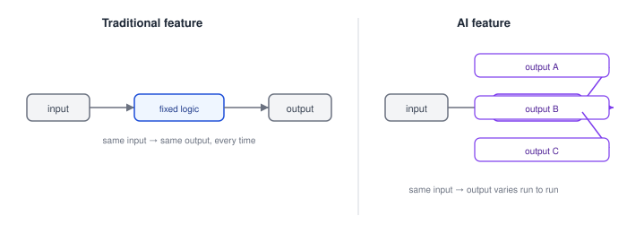
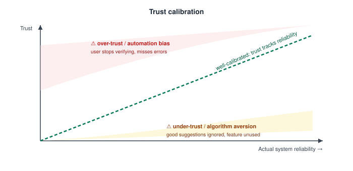

# AI Product Design — Designing for AI: Unique UX Challenges (Uncertainty, Non-Determinism, Trust)

_Last updated: 2026-09-25_

## Overview

Traditional software UX assumes a deterministic contract: same input, same output, every time — the bedrock most usability heuristics and mental-model design are built on. AI-powered features break that contract in three specific ways — non-determinism, uncertainty, and variable trustworthiness — and most of "designing for AI" is really about designing around these three breaks.

## Non-Determinism

The same input can produce different outputs across runs, model versions, or even just sampling settings.

Consequences for design:

- **Reproducibility expectations break** — "it worked yesterday" is a legitimate bug report for normal software; for an AI feature it might just be normal variance. Support/debugging flows need to account for this (e.g. capturing the exact output + prompt/context at the time, not just "it's broken").
- **A/B testing and QA get harder** — you can't assert "given X, output is always Y" the way you would for deterministic code; testing shifts toward statistical acceptance criteria (e.g. "correct ≥95% of the time on this eval set") rather than pass/fail per case.
- **Users need a different mental model** — "this is a probabilistic assistant, not a calculator" is itself a UX/onboarding problem, not just a technical fact.

## Uncertainty

Unlike a lookup or calculation, an AI output usually comes with a confidence level — but that confidence is invisible unless the interface surfaces it. Two failure modes:

- **Hiding uncertainty entirely** — presenting a generated answer with the same visual authority as a verified fact (e.g. a confidently-worded hallucinated citation). AI-generated content often looks too polished/authoritative for how unreliable it actually is, and that mismatch causes real harm.
- **Exposing raw uncertainty badly** — dumping a raw confidence score ("73.2%") on a user who has no calibration for what that number means in context.

Design patterns that work better than either extreme:

- **Qualitative confidence bands** instead of raw numbers (e.g. "likely," "uncertain," "low confidence — please verify") — matches how people actually reason about uncertainty.
- **Surfacing sources/evidence** rather than (or alongside) a confidence score — lets the user do their own verification instead of just trusting a number.
- **Graceful hedging in the copy itself** — "This might be what you're looking for" vs. a flatly declarative statement, when the system genuinely isn't sure.

## Trust Calibration

This is the throughline connecting non-determinism and uncertainty. The design goal isn't "maximize trust" — it's **calibrated trust**: user trust should track actual system reliability, not exceed or undershoot it.

- **Over-trust (automation bias)** — users stop scrutinizing outputs because the system has been right often enough. Dangerous in high-stakes contexts (medical, legal, financial) where the rare wrong answer causes real damage precisely because no one was checking anymore.
- **Under-trust (algorithm aversion)** — users reject or ignore a genuinely good AI suggestion, often after seeing it fail once, even when it's statistically more reliable than their own judgment. A single visible failure can disproportionately tank trust relative to many invisible successes.

Design levers that help calibrate trust correctly:

- **Onboarding that sets accurate expectations up front** — telling users what the feature is good/bad at before they rely on it, rather than letting them discover failure modes the hard way.
- **Consistent friction proportional to stakes** — low-stakes suggestions (autocomplete) can be accepted with zero friction; high-stakes actions (an AI drafting a message that gets sent, or an agent taking an irreversible action) should require an explicit confirm step, surfacing what will happen.
- **Visible, easy correction** — if the user can effortlessly correct/dismiss a wrong output, it both fixes the immediate error and reinforces an accurate mental model ("this makes mistakes, but I catch them cheaply, so I don't need to be paranoid or dismissive").

## Why This Matters More Than Typical UX Challenges

In deterministic software, a bug is discrete and fixable — once fixed, it stays fixed. In AI products, "wrongness" is a continuous, ongoing property of the system rather than a bug to eliminate. The design problem shifts from "prevent errors" (classic heuristic-evaluation thinking) to "design an interface that keeps the human appropriately in the loop given that errors will keep happening at some non-zero rate."

## Key Takeaways

- AI features break the deterministic input→output contract that most traditional UX assumptions are built on, via non-determinism, uncertainty, and variable trustworthiness.
- Non-determinism requires new mental models for users and new (statistical, not pass/fail) QA/testing approaches.
- Uncertainty should be surfaced in qualitative, actionable ways (confidence bands, sources, hedged copy) — not hidden, and not dumped as raw unexplained numbers.
- The design goal is calibrated trust, not maximized trust — avoiding both automation bias (over-trust) and algorithm aversion (under-trust).
- Friction should scale with stakes: near-zero friction for low-stakes suggestions, explicit confirmation for high-stakes/irreversible AI actions.
- Because AI "wrongness" is continuous rather than a fixable bug, the design problem is keeping humans appropriately in the loop, not eliminating errors.
