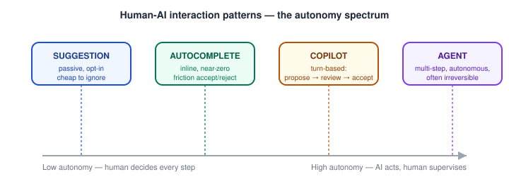

# AI Product Design — Human-AI Interaction Patterns (Suggestions, Autocomplete, Agents, Copilots)

_Last updated: 2026-09-25_

## Overview

The "friction proportional to stakes" principle from [Designing for AI - unique UX challenges](01.%20Designing%20for%20AI%20-%20unique%20UX%20challenges%20%28uncertainty%2C%20non-determinism%2C%20trust%29.md) organizes the whole landscape of Human-AI interaction patterns: they sit along a spectrum of how much autonomy the AI has per interaction, and each point on that spectrum implies different UX requirements.

## The Autonomy Spectrum

Each stage trades off speed of interaction against how much the human verifies before anything happens — the trust/friction tradeoff from the previous doc, expressed as a concrete interaction pattern instead of an abstract principle.

## Suggestion

A passive recommendation the user can take or leave — "You might also like…", a suggested reply, a recommended next action. The AI never acts on its own; it just surfaces an option.

- **Lowest commitment, lowest friction to ignore** — a wrong suggestion costs the user almost nothing (they just don't click it), which is why this pattern tolerates lower-confidence outputs than the others.
- Suggestions must be **easily dismissible/ignorable without penalty** — if ignoring a bad suggestion is annoying (it keeps reappearing, or crowds out primary content), users disengage from the whole feature, not just that one suggestion.

## Autocomplete

Predictive completion inline with what the user is already doing — text autocomplete, code completion, form-field prediction. The defining UX constraint is **latency and flow preservation**, not confidence.

- Must be near-instant (sub-100ms-feeling) or it breaks the user's flow rather than assisting it.
- Acceptance must be **zero-cost** (a single keystroke — Tab/→) and rejection must be **equally zero-cost**: just keep typing, no explicit "no thanks" required. This asymmetry — cheap accept, even cheaper implicit reject — is what makes autocomplete tolerable even when it's wrong often.
- Because rejection is so cheap, autocomplete can ship at lower accuracy than a suggestion pattern would tolerate — the cost of being wrong is almost nothing.

## Copilot

A collaborative, turn-based pattern: the AI proposes a substantive chunk of work (a code diff, a drafted paragraph, a generated image), and the human reviews and explicitly accepts, edits, or rejects before it takes effect. Think GitHub Copilot's multi-line suggestions, or a writing assistant proposing a rewritten paragraph.

- Unlike autocomplete, the unit of work is large enough that **review actually happens** — a deliberate design point, not a limitation: it's the friction that keeps trust calibrated for higher-stakes output than a single word.
- Requires good **diffing/preview affordances** — the human needs to see exactly what would change, not just the proposed end state, to review efficiently.
- Sits at the "human decides, AI proposes" boundary — usually the right default for anything hard to undo or expensive to get wrong (a sent email, committed code).

## Agent

The AI plans and executes multiple steps toward a goal with reduced per-step human confirmation — e.g. "book me a flight to Boston next Tuesday" resulting in the system searching, comparing, and potentially booking without a human reviewing every intermediate step.

This is the highest-autonomy end and needs its own dedicated design machinery, because the earlier patterns' safety nets (cheap rejection, per-step review) don't naturally apply when steps happen faster than a human can review them:

- **Visibility of the plan/trajectory** — surface what the agent intends to do (and, ideally, is currently doing) rather than presenting only a final result. This lets a human catch a bad plan before it executes, not just a bad output after.
- **Scoped permissions (least privilege)** — an agent should only be granted the access/actions actually required for the task at hand, so a wrong decision has a bounded blast radius rather than access to everything the user could do.
- **Checkpoints for irreversible actions** — even a highly autonomous agent should pause for explicit confirmation before anything hard to undo (spending money, sending something externally, deleting data) — the "friction proportional to stakes" principle applied directly.
- **An accessible stop/interrupt control** — the human must be able to halt a multi-step process mid-flight, not just approve/reject at the start and the end.

## Key Takeaways

- Human-AI interaction patterns form a spectrum of autonomy: suggestion → autocomplete → copilot → agent, each trading interaction speed against how much the human verifies before something happens.
- Suggestion: passive, must be cheaply ignorable; tolerates lower confidence because the cost of being wrong is near zero.
- Autocomplete: needs near-instant latency and zero-cost accept/reject; cheap rejection is what allows it to work even at imperfect accuracy.
- Copilot: turn-based propose → review → accept on substantive chunks of work; needs strong diff/preview affordances; the right default for anything costly to undo.
- Agent: multi-step and autonomous, needing its own safety machinery — visible plans/trajectories, least-privilege scoping, checkpoints before irreversible actions, and an accessible interrupt/stop control.
- This spectrum is the practical, pattern-level expression of the friction-proportional-to-stakes principle from trust calibration.
