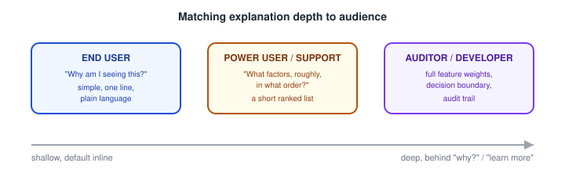

# AI Product Design — Explainability and Transparency in AI Interfaces

_Last updated: 2026-09-25_

## Overview

Explainability generalizes two ideas already covered — uncertainty communication and agent plan visibility — into a single question: when the system does something, how does it communicate why? This doc covers the distinction between transparency and explainability, global vs. local explanations, common explanation mechanisms, the risk of plausible-but-untrue explanations, and matching explanation depth to the audience.

## Transparency vs. Explainability

These get used interchangeably but mean different things:

- **Transparency** — openly showing what the system is doing, as it happens (or before it happens). Process-level. Example: an agent showing its plan ("Step 1: search flights, Step 2: compare prices…") before executing — see [Human-AI interaction patterns](02.%20Human-AI%20interaction%20patterns%20%28suggestions%2C%20autocomplete%2C%20agents%2C%20copilots%29.md).
- **Explainability** — after a specific output/decision, providing a rationale for why that particular result came out the way it did. Decision-level. Example: "We recommended this because you bought similar items in the past."

A system can be transparent about its process while still being unexplainable about a specific output — you can watch every step an LLM takes and still not get a clean, causally-accurate reason for one particular word choice. Good AI UX generally needs both, but they solve different user questions ("what is it doing" vs. "why did it do that").

## Global vs. Local Explanations

- **Global explanation** — how the model behaves in general. "This spam filter generally weighs sender reputation, link count, and urgent language." Builds an accurate overall mental model of the system's capabilities/limits — ties back to onboarding/expectation-setting from [trust calibration](01.%20Designing%20for%20AI%20-%20unique%20UX%20challenges%20%28uncertainty%2C%20non-determinism%2C%20trust%29.md).
- **Local explanation** — why this specific output happened. "This email was flagged as spam because it contains a link to a domain registered yesterday." Useful in the moment, when a user needs to decide whether to trust/override one particular result.

Most user-facing explainability UI is local — it answers "why this, right now" — while global explanation tends to live in onboarding/help content rather than inline in the interface.

## Common Explanation Mechanisms

- **Feature attribution** — "based on X, Y, Z" (e.g. "recommended because you watched similar shows"). The most common pattern in consumer products; simple and usually good enough for low-stakes decisions.
- **Counterfactual explanation** — "if X had been different, the result would have changed" (e.g. "your loan application would likely be approved with $5,000 more in reported income"). More actionable than attribution alone — tells the user what lever to pull, not just what was considered.
- **Example-based explanation** — "here are similar cases and their outcomes" — lets the user calibrate by analogy rather than by mechanism.
- **Process transparency** — showing the steps/trajectory rather than explaining a single output (the agent-visibility pattern).

## The Critical Trap: Plausible ≠ True

The sharpest AI-specific version of this problem: an explanation — especially one generated by the same model that produced the answer, e.g. an LLM asked "why did you say that?" — can be **fluent and convincing without accurately reflecting the actual computation** that produced the output. This is sometimes called post-hoc rationalization — the explanation is a plausible-sounding story generated after the fact, not a trace of the real reasoning.

This matters for design because a persuasive-sounding explanation can *increase* trust beyond what's warranted — directly undermining the calibrated-trust goal. A well-designed explanation UI should avoid implying more rigor than actually exists (e.g. don't present a generated rationale with the same visual certainty as an audited decision trail from a real feature-attribution system).

## Matching Explanation Depth to the Audience

The same underlying decision needs different explanation altitudes depending on who's asking:

Progressive disclosure is the standard pattern: default to the shallow, plain-language version inline, with an optional "learn more" / "why?" affordance that expands to more mechanistic detail for users who want it — rather than picking one fixed depth for everyone.

## Key Takeaways

- Transparency (showing the process as it happens) and explainability (justifying a specific past output) answer different user questions and both matter, but aren't interchangeable.
- Global explanations build an overall mental model (good for onboarding); local explanations justify one specific result (good for in-the-moment trust decisions).
- Feature attribution, counterfactual explanation, and example-based explanation are the main mechanisms; counterfactuals are the most actionable because they tell the user what to change.
- A generated explanation can be fluent and convincing without accurately reflecting the model's real reasoning (post-hoc rationalization) — over-trusting a plausible-sounding explanation directly undermines calibrated trust.
- Match explanation depth to audience via progressive disclosure: shallow plain-language by default, with an optional path to deeper mechanistic detail.
