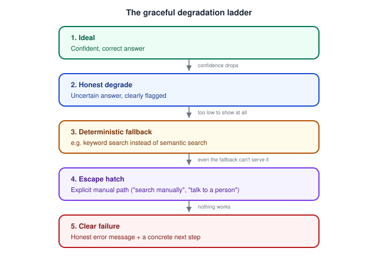

# AI Product Design — Designing for Errors, Edge Cases, and Model Failure Modes

_Last updated: 2026-09-25_

## Overview

Traditional error handling assumes failures are discrete and detectable — a null pointer, a 500 status code, something the system itself can recognize and report. AI failure modes break that assumption: the most dangerous failures don't announce themselves. This doc covers why AI failures differ from traditional bugs, the graceful degradation ladder for handling them, and concrete design strategies for bounding the damage.

## Why AI Failures Are Different

- **Confidently wrong, not crashed** — a traditional bug usually manifests as a visible break (a blank screen, an error toast). A model failure often looks identical to a success: fluent, well-formatted, confidently stated — just wrong. This is the single biggest design challenge in this space, because the interface gives the user no natural signal that something failed.
- **Out-of-distribution inputs** — the model behaves unpredictably on inputs unlike anything in training data, and there's no clean way to detect "this is weird" the way you'd validate a form field against a schema.
- **Partial failure in multi-step flows** — an agent might correctly complete 3 of 5 steps and silently botch the 4th; unlike a transaction that atomically commits or rolls back, there's often no natural all-or-nothing boundary.
- **Cascading failure** — in an agent chain, an early wrong step (e.g. misreading a date) compounds through every subsequent step, and by the end the failure is far removed from its actual cause, making it hard to diagnose.
- **Silent drift** — the underlying model gets updated/retrained, and previously reliable behavior shifts without any release notes the user sees — a failure mode with no discrete "before/after" the user can point to.

## The Graceful Degradation Ladder

Instead of a binary "worked / crashed," design for a ladder of fallbacks, so a failure at any level still leaves the user somewhere useful rather than stuck:

The point of the ladder: a low-confidence result should demote itself to a lower rung rather than being presented with the same confident framing as rung 1 — this is the design-level mechanism that actually implements the "don't hide uncertainty" principle from [Designing for AI - unique UX challenges](01.%20Designing%20for%20AI%20-%20unique%20UX%20challenges%20%28uncertainty%2C%20non-determinism%2C%20trust%29.md), applied specifically to failure rather than to normal operation.

## Concrete Design Strategies

- **Escape hatches are non-negotiable** — always leave a manual/traditional path alongside the AI path (a "search manually" link next to AI search, a "talk to a human" option next to a support bot). This bounds how bad an AI failure can be: the user is inconvenienced, not blocked.
- **Bound the blast radius** — undo affordances, versioning, and checkpoints before irreversible actions (the agent-design principles from [Human-AI interaction patterns](02.%20Human-AI%20interaction%20patterns%20%28suggestions%2C%20autocomplete%2C%20agents%2C%20copilots%29.md) apply directly here — a failure in a reversible action is an annoyance, a failure in an irreversible one is a real problem).
- **Error messages should explain, not just report** — "Error 500" tells a user nothing actionable; an AI-feature failure message should say roughly what happened and what to try next ("I couldn't find a confident match — try rephrasing, or browse manually"), because the user has no other way to diagnose a probabilistic failure themselves.
- **Capture feedback right at the point of failure** — a lightweight "this wasn't right" affordance exactly where the bad output appeared, not buried in a separate feedback form. This becomes the input to human-in-the-loop feedback systems.
- **Test edge cases adversarially, not just typical cases** — because failures are statistical rather than deterministic bugs, QA needs a deliberate set of edge-case/adversarial inputs (ambiguous phrasing, out-of-scope requests, edge-of-training-distribution inputs) evaluated against acceptance thresholds, not a pass/fail suite.

## Key Takeaways

- AI failures are often confidently wrong rather than visibly broken — the interface gets no natural signal that something failed, unlike a traditional crash or error code.
- Out-of-distribution inputs, partial failure in multi-step flows, cascading failure in agent chains, and silent model drift are AI-specific failure categories without clean traditional-software analogues.
- Design for a graceful degradation ladder — confident correct, honestly-flagged uncertain, deterministic fallback, manual escape hatch, clear failure — so a failure at any level still leaves the user somewhere useful.
- Escape hatches (a manual/non-AI path) and bounded blast radius (undo, checkpoints) are the two design levers that most directly limit how bad a failure can get.
- Capture "this wasn't right" feedback exactly at the point of failure, and test with deliberate adversarial/edge-case inputs rather than a traditional pass/fail suite.
