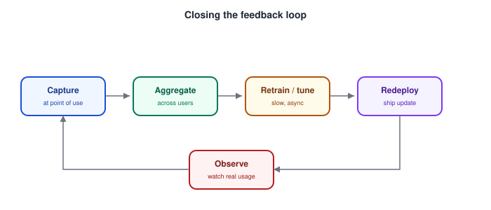

# AI Product Design — Feedback Loops and Human-in-the-Loop Design

_Last updated: 2026-09-25_

## Overview

The "capture feedback at the point of failure" idea from [Designing for errors, edge cases, and model failure modes](04.%20Designing%20for%20errors%2C%20edge%20cases%2C%20and%20model%20failure%20modes.md) is one instance of a much bigger pattern: human-in-the-loop (HITL) design, where people don't just consume AI output, they actively participate in correcting, reviewing, or improving the system over time. This doc covers the types of feedback signal, how the feedback loop closes as a system, HITL vs. human-on-the-loop (HOTL), and the failure modes of feedback loops themselves.

## Types of Feedback Signal

- **Implicit feedback** — inferred from behavior: did the user accept the autocomplete suggestion, click the top search result, keep or discard a draft? High volume, effectively free to collect, but a noisy signal. The key trap: users often **satisfice** — accept a "good enough" suggestion rather than the objectively best one — so "accepted" doesn't cleanly mean "correct."
- **Explicit feedback** — thumbs up/down, "report an issue," a star rating. Clearer intent than implicit signals, but low volume and biased toward extremes: people mostly bother rating when something is very good or very bad, rarely for the mediocre-but-fine middle. Treat explicit feedback rates as a biased sample, not a representative one.
- **Corrective feedback** — the user actually fixes the output (edits an AI-drafted email, corrects a mis-transcribed word). This is the richest signal of the three: it shows not just that something was wrong but what right looks like, as a usable before/after diff — far more valuable for improving the system than a binary rating.

## Closing the Loop

A feedback loop is a system, not a single UI element:

Two design implications that are easy to miss:

- **Capture where the feedback is cheapest and most natural** — right at the point of use/failure (a correction affordance inline with the bad output), not in a separate survey the user has to seek out. This is the same principle from the error-handling doc, generalized.
- **Close the loop visibly** — if users never see their feedback have any effect, they stop giving it. Even a lightweight signal ("thanks, we're improving this") sustains engagement with the feedback mechanism far better than silence.

Unlike a traditional bug fix, this loop is usually slow and asynchronous — feedback needs to aggregate before a retrain, and a retrain needs validation before redeploying. That gap matters for design: if a specific output is badly wrong, don't rely solely on "we'll fix it next training run" — pair the feedback loop with an immediate, direct mitigation (e.g. a blocklist/override for that specific bad case) so the fix isn't gated on the whole slow pipeline.

## Human-in-the-Loop vs. Human-on-the-Loop

This distinction maps directly onto the autonomy spectrum from [Human-AI interaction patterns](02.%20Human-AI%20interaction%20patterns%20%28suggestions%2C%20autocomplete%2C%20agents%2C%20copilots%29.md) (suggestion → autocomplete → copilot → agent):

| | Human-in-the-loop (HITL) | Human-on-the-loop (HOTL) |
|---|---|---|
| **Role** | Human must approve *before* the action executes | Human monitors an ongoing process and *can* intervene, but doesn't have to approve every step |
| **Maps to** | Copilot pattern — propose → review → accept | Agent pattern with checkpoints — autonomous execution, human watches and can stop it |
| **Best for** | High-stakes, low-volume decisions where each one deserves scrutiny (content moderation escalations, medical diagnosis review, large financial transactions) | High-volume or fast-moving processes where per-step approval isn't feasible, but oversight and an interrupt path are still required |

Choosing between them isn't just a UX preference — it's the same stakes/friction calculus from trust calibration, applied to how much the human needs to be in the decision path rather than just how much confirmation UI they see.

## Two Failure Modes of Feedback Loops Themselves

- **Feedback fatigue** — asking for feedback on every interaction trains users to dismiss the prompt reflexively (or ignore the feature entirely). Sample deliberately: ask when the signal is genuinely valuable (low-confidence outputs, a random small percentage of interactions) rather than every time.
- **Reward hacking / optimizing the wrong signal** — if a system is tuned to maximize explicit approval (e.g. thumbs-up rate), it can drift toward outputs people like in the moment rather than outputs that are actually correct — a well-documented risk with sycophantic behavior in generated text. The feedback signal is a proxy for quality, not quality itself, and optimizing the proxy too directly can quietly diverge from the actual goal.

## Key Takeaways

- Implicit feedback is high-volume but noisy (satisficing); explicit feedback is clearer but low-volume and biased toward extremes; corrective feedback (the user's actual fix) is the richest signal because it shows both the error and the correct answer.
- A feedback loop is capture → aggregate → retrain → redeploy → observe — capture where feedback is cheapest to give (at point of use), and close the loop visibly or users disengage.
- The loop is inherently slow/asynchronous; pair it with immediate direct mitigations for specific bad outputs rather than waiting on the full retrain cycle.
- Human-in-the-loop (approve before action, maps to copilot) vs. human-on-the-loop (monitor with intervention capability, maps to agent-with-checkpoints) is the same stakes/friction principle applied to decision-path involvement.
- Feedback loops have their own failure modes: fatigue from over-asking, and reward hacking, where optimizing the feedback signal itself (e.g. approval rate) can drift away from actual output quality.
