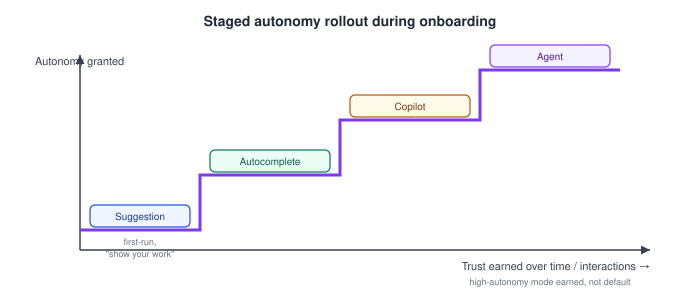

# AI Product Design — Onboarding and Calibrating User Trust and Expectations for AI Features

_Last updated: 2026-09-25_

## Overview

This subtopic is where trust calibration, the autonomy spectrum, and error handling all converge into a single design job: the first few minutes of using an AI feature need to teach the user an accurate reliability model, not just the mechanics of the UI. This doc covers why AI onboarding differs from traditional feature onboarding, concrete onboarding techniques, and why calibration has to be maintained continuously rather than set once.

## Why AI Onboarding Is a Different Problem

Traditional onboarding teaches *how to use* something — where the buttons are, what a gesture does. That's still necessary for AI features, but it's not sufficient, because AI features carry an extra unknown: how reliable is this, and under what conditions does it break? Without that second layer, users default to one of the two miscalibrated extremes from [trust calibration](01.%20Designing%20for%20AI%20-%20unique%20UX%20challenges%20%28uncertainty%2C%20non-determinism%2C%20trust%29.md) — over-trust or under-trust — essentially at random, based on whatever their first few interactions happened to look like.

The core bias onboarding has to correct for is the **capability-reliability gap**: a fluent, articulate, confident-sounding AI *feels* more reliable than it actually is, because people (reasonably, for humans) use articulateness as a proxy for competence. Left uncorrected, this bias pushes almost everyone toward over-trust by default — so onboarding's job is specifically to counteract that default, not just to explain features.

## Concrete Onboarding Techniques

- **Explicit first-run expectation setting** — state plainly, with a concrete example of both a success *and* a known limitation, what the feature is good and bad at ("can draft replies for you; may misunderstand sarcasm or nuance"). Abstract disclaimers ("AI may make mistakes") are usually too vague to actually recalibrate behavior — a specific example of a real failure mode does far more work.
- **Staged autonomy rollout** — don't grant the highest-autonomy mode (agent-level automation) on day one.

  

  Start the user at the low-stakes end of the [autonomy spectrum](02.%20Human-AI%20interaction%20patterns%20%28suggestions%2C%20autocomplete%2C%20agents%2C%20copilots%29.md) (suggestion/autocomplete) where mistakes are cheap to reject, and only surface higher-autonomy modes (copilot, agent) once the user has had enough low-stakes interactions to form an accurate sense of the system's reliability. Trust is earned incrementally, not granted upfront.
- **Deliberately "showing your work" early** — in the first several interactions, surface sources, confidence, or reasoning even if it adds friction that a power user would later want to skip. This is temporary scaffolding: the goal is an accurate mental model *before* the experience streamlines into the low-friction default.
- **Letting users witness a failure safely** — some products intentionally don't hide or suppress the first mistake during onboarding, or engineer a low-stakes example of a known limitation early on. This matters because a string of early successes with no visible failure can produce false confidence that later collapses at a high-stakes moment — it's better for the first failure to happen when the stakes are low and the user is primed to notice it.

## Calibration Isn't a One-Time Event

Because model capability can change silently — the drift problem from [Designing for errors, edge cases, and model failure modes](04.%20Designing%20for%20errors%2C%20edge%20cases%2C%20and%20model%20failure%20modes.md) — a user's trust calibration can go stale even if their initial onboarding was perfect. This means recalibration has to recur:

- When a meaningful capability change ships, treat it like a small onboarding moment again — a "we've improved X" or "this can now do Y" notice, rather than silently changing behavior underneath an unchanged interface.
- The inverse also matters: if a capability got worse or was restricted (e.g. for safety reasons), silently degrading without any note leaves users over-trusting a feature that's actually been pulled back.

## Key Takeaways

- AI onboarding must teach an accurate reliability model, not just UI mechanics — without it, users default unpredictably to over-trust or under-trust.
- The capability-reliability gap (fluent output looks more reliable than it is) biases most users toward over-trust by default; onboarding's specific job is to counteract that bias.
- Concrete techniques: explicit expectation-setting with real success/failure examples, staged autonomy rollout (earn trust before granting higher-autonomy modes), temporarily "showing your work" early, and letting users witness a safe failure rather than hiding it.
- Trust calibration is not a one-time onboarding event — it needs to recur whenever capability meaningfully changes (better or worse), or the user's mental model goes stale relative to the actual system.
