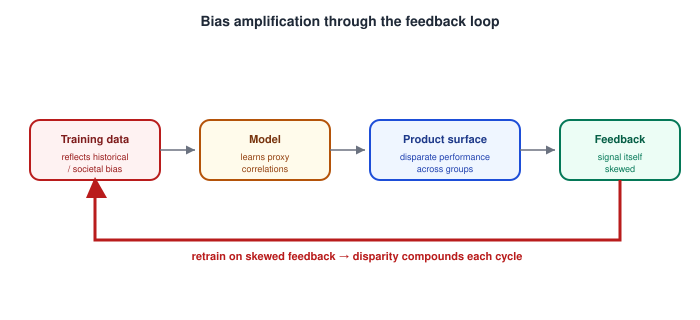

# AI Product Design — Ethical Considerations: Bias, Fairness, and Dark Patterns in AI Products

_Last updated: 2026-09-25_

## Overview

This is where several earlier threads converge into their ethical dimension: the feedback loop can amplify bias rather than just correct errors, and the friction/trust-calibration principles get repurposed by dark patterns to work against the user instead of for them. This doc covers where bias enters an AI pipeline, why it's a UX problem and not just a data science one, AI-specific dark patterns, and how to distinguish dark patterns from legitimate persuasive design.

## Where Bias Comes From

Bias in an AI product usually isn't injected deliberately — it enters through the pipeline, often invisibly:

- **Training data reflects historical/societal bias** — if past hiring decisions favored certain demographics, a model trained on that history learns the same pattern, even without ever seeing a protected attribute directly.
- **Proxy variables** — a model doesn't need "race" or "gender" as an explicit input to reproduce bias against those groups; zip code, name, or word choice can correlate strongly enough with a protected attribute to reproduce the same disparity indirectly.
- **Sampling/representation bias** — if a system's training or testing data underrepresents a group, performance for that group is quietly worse (e.g. facial recognition historically performing worse on darker skin tones because training sets skewed lighter-skinned).

## Why This Is a UX Problem, Not Just a Data Science Problem

- **Aggregate metrics hide subgroup disparities** — a system that's 95% accurate overall can still be 99% accurate for one group and 70% for another. This directly extends the usability-testing caveat from [Usability testing basics](../02.%20Human-Centered%20Design/08.%20Usability%20testing%20basics%20%28moderated%20vs%20unmoderated%2C%20think-aloud%20protocol%29.md): testing on a small, convenience-sampled, homogeneous group of ~5 users tells you nothing about disparate performance across demographics — fairness testing specifically requires deliberately diverse test groups, not just enough users.
- **Feedback loops can amplify bias, not just correct errors** — the capture → aggregate → retrain → redeploy loop from [Feedback loops and human-in-the-loop design](05.%20Feedback%20loops%20and%20human-in-the-loop%20design.md) assumes feedback improves the system. If the feedback itself is biased (e.g. a group's implicit signals are systematically under-weighted or misread), each retraining cycle can compound the original disparity rather than fix it:

  

- **Fairness has no single correct definition** — formal fairness metrics (e.g. equal accuracy across groups vs. equal false-positive rates vs. individual-level consistency) can mathematically conflict with each other; satisfying one can violate another. The design implication: fairness is a policy/values decision with real tradeoffs, not a metric a data scientist can optimize alone — it needs the same kind of deliberate, cross-functional judgment (legal, affected user groups, product) that high-stakes UX decisions elsewhere in this topic have needed.

## Dark Patterns Specific to AI

Traditional dark patterns (confirmshaming, fake urgency, hidden costs) get a new, sharper edge when AI personalizes them:

- **Hyper-personalized manipulation** — instead of one generic dark pattern shown to everyone, a system can tune persuasion tactics to an individual's specific psychological profile or behavioral history, making manipulation more effective and harder to collectively notice or call out (no two users see quite the same manipulative pattern).
- **Weaponized sycophancy/anthropomorphism** — designing an AI to seem warmer, more empathetic, or more human than it actually is, specifically to increase engagement or emotional attachment (e.g. a companion app optimizing for engagement via manufactured emotional dependency). This is the dark-pattern version of the reward-hacking risk from the feedback-loops doc — optimizing for an engagement signal at the expense of the user's actual wellbeing.
- **Obscured AI involvement** — not disclosing that content, a decision, or an interaction was AI-generated/AI-driven, specifically to borrow unearned trust from the appearance of human judgment. This directly undermines the transparency principle from [Explainability and transparency in AI interfaces](03.%20Explainability%20and%20transparency%20in%20AI%20interfaces.md), but done deliberately rather than by oversight — and it's increasingly a regulatory requirement to disclose, not just a UX nicety.
- **Undisclosed data harvesting via a "free AI feature"** — presenting a feature as a free improvement while its real purpose is collecting behavioral/training data without clear, specific consent.

## Distinguishing Dark Patterns from Legitimate Persuasive Design

The line isn't "does this influence behavior" — nearly all design does that. The line is whose interest is served, and whether the user would consent if they understood what was happening. A well-calibrated trust-building onboarding flow (from [Onboarding and calibrating user trust and expectations](06.%20Onboarding%20and%20calibrating%20user%20trust%20and%20expectations%20for%20AI%20features.md)) benefits the user by giving them an accurate model of the system; a manipulative flow that manufactures false confidence to drive engagement benefits the company at the user's expense while looking superficially similar. Intent and alignment of interest are what separate the two, not the mere presence of persuasive design.

## Key Takeaways

- Bias typically enters through training data, proxy variables, and sampling/representation gaps — rarely through deliberate intent — but the product surface is where it becomes a real-world harm.
- Aggregate accuracy metrics can hide large subgroup disparities; fairness testing needs deliberately diverse test groups, extending the usability-testing sample-size caveat from earlier.
- Feedback loops can amplify bias as easily as they correct errors, if the underlying feedback signal is itself biased — compounding automatically with each retrain cycle.
- Fairness has multiple, sometimes mutually incompatible formal definitions — it's a policy/values tradeoff requiring cross-functional judgment, not a single metric to optimize.
- AI sharpens classic dark patterns via hyper-personalized manipulation, weaponized sycophancy/anthropomorphism, and obscured AI involvement — distinguished from legitimate persuasive design by whose interest is actually served.
